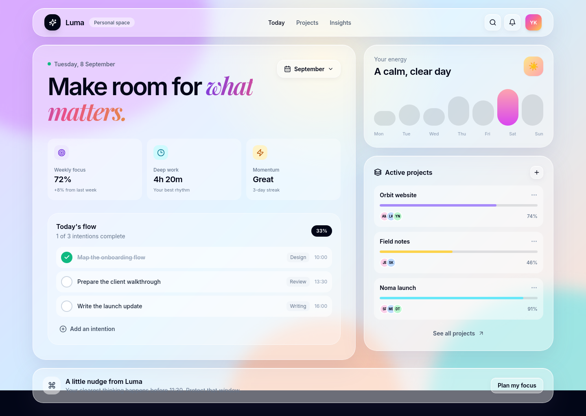

# Luma — Liquid Glass Focus Dashboard

Luma is a colorful personal-focus dashboard built as a non-music reinterpretation of the original liquid-glass interface. It combines frosted, translucent panels with animated lavender, cyan, peach, fuchsia, and amber liquid forms.



## Highlights

- Multi-color animated liquid background with glassmorphism panels
- Daily focus summary, energy trend, and active project progress
- Interactive task checklist and “add intention” action
- Responsive React + Vite UI

## Run locally

```bash
npm install
npm run dev
```

Then open `http://localhost:5173`.

## Build

```bash
npm run build
```

## Stack

React, Vite, Tailwind CSS, and Lucide icons.
